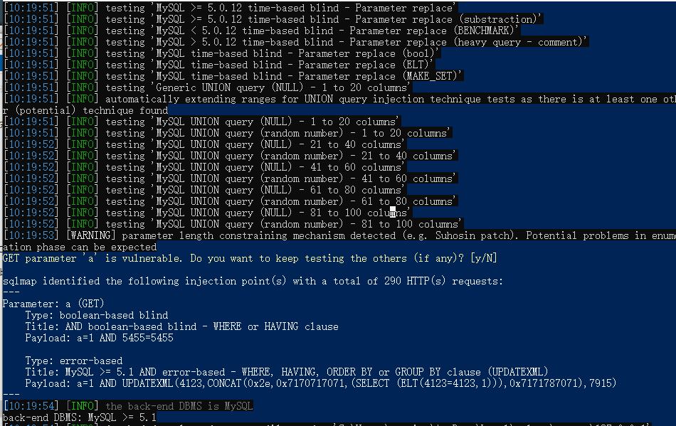
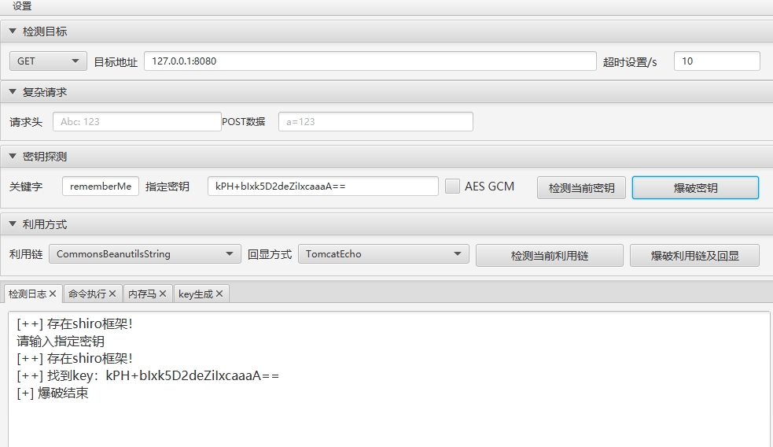
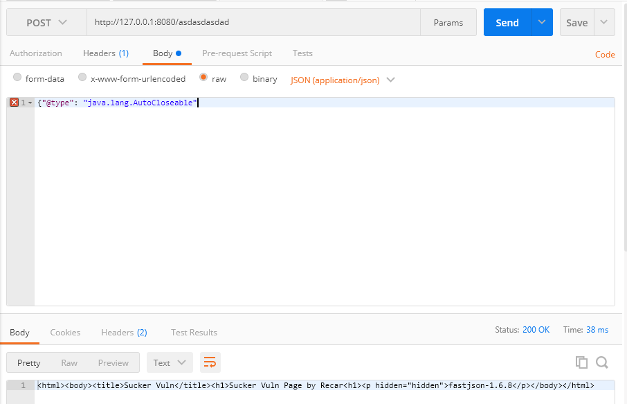

## sucker

命名为吸盘 可以吸附到 真实的环境上 可以对http服务附加以下漏洞

简单来说可以让任何一个网站添加任何的漏洞 当然这个漏洞是假的
可以欺骗扫描器 

### 支持模拟的漏洞

+ fastjson 验证和 dnslog验证
+ log4j dnslog验证
+ shiro 框架判断和秘钥爆破
+ sqli 布尔注入 报错注入

### 支持的模式

+ 本身作为http服务对外提供
+ 反向代理 对外提供 漏洞会以追加到响应的方式


## 使用
可以在这里下载 https://github.com/Ciyfly/sucker/releases

```
NAME:
   sucker by recar - sucker 

USAGE:
   sucker by recar [global options] command [command options] [arguments...]

VERSION:
   0.1

COMMANDS:
   help, h  Shows a list of commands or help for one command

GLOBAL OPTIONS:
   --debug, -d                       turn on debug log (default: false)
   --help, -h                        show help (default: false)
   --lhost value, -l value           listen host defalut 0.0.0.0 (default: "0.0.0.0")
   --lport value, -p value           listen port defalut 8080 (default: 8080)
   --mode value, -m value            service mode value: server,proxy default server
   --proxy_target value, --pt value  reverse proxy to proxy_target E.g: 127.0.0.1:8787
   --version, -v                     print the version (default: false)

```

### 以本身服务举例
```
./sucker.exe
2022-10-07 22:05:07.286	INFO	0.0.0.0, 8080, server
```

使用反向代理转发的话 需要指定代理的服务
```shell
.\sucker.exe -m proxy -pt 127.0.0.1:8787
2022-10-08 10:36:09.177 INFO    0.0.0.0:8080 -> proxy
```

### sqli



### shiro




#### fastjson log4j 都是支持dnslog的形式



fastjson支持验证的payload 
```
{"@type":"java.net.Inet4Address","val":"dnslog"}

```

log4j 的
```
{"@type":"java.net.Inet4Address","val":"${jndi:ldap://dnslog}"}
```
因为这两个可以说是都是借助dnslog的方式验证 大致原理相似

### 使用场景
+ 蜜罐
+ 其他

### 说明
只是验证自己的一个想法 只是个demo  
